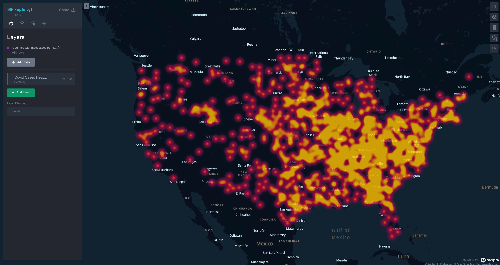

# Stardog React Kepler

This project was inspired by [Analyzing COVID-19 Data with SPARQL](https://www.stardog.com/labs/blog/analyzing-covid-19-data-with-sparql/) blog post.

It is using the [express server](https://express.stardog.cloud:5820) of [stardog](www.stardog.com) cloud. The database name is `covid19nyt`.

This project uses kepler.gl to render the data on the map. For the query to work, it was adjusted to get the latitude and longitude of each county reported by NYT. You can see the query [here](./src/queries/covidCasesQueries.ts).

## Demo

https://rossjackson.github.io/stardog-react-kepler/

## Environment Variables

-   `REACT_APP_MAPBOX_TOKEN` - kepler.gl is built upon [Mapbox](https://www.mapbox.com/). You will need a [Mapbox Access Token](https://www.mapbox.com/help/define-access-token/) to use it.
